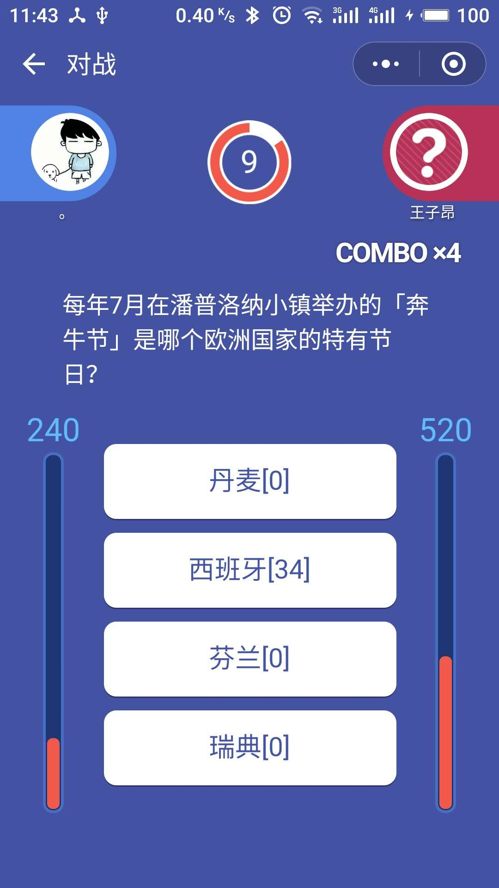

# tounao
微信小游戏头脑王者辅助程序, 欢迎fork

# 快速开始
1. 编译运行,或使用 release
2. 将手机和PC置于同一网段，用手机浏览器打开地址 http://<host>:8080 下载安装证书，请将<host>替换为PC的ip地址
3. 修改手机的代理设置为PC的IP地址，端口为8989
4. 进入游戏，选项会被替换，格式如下：以[标答]结尾的选项为题库中已经存在的题目，[数字]结尾的选项，数字为百度结果的权重，仅供参考

# 功能
1. 分词权重
2. 使用ADB 实现Android自动点按，半自动刷分
3. sqlite3 缓存题库

# 问题
1. goproxy 无法代理 websocket 导致IOS无法使用代理进入游戏，希望各路大神能提供建议

# 示例

